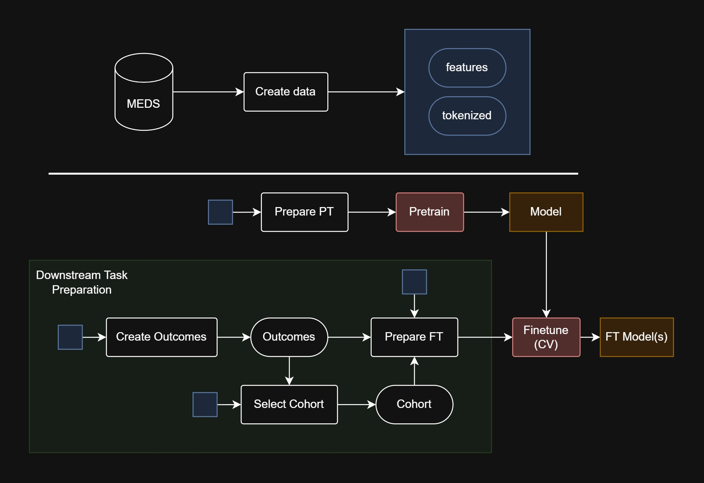
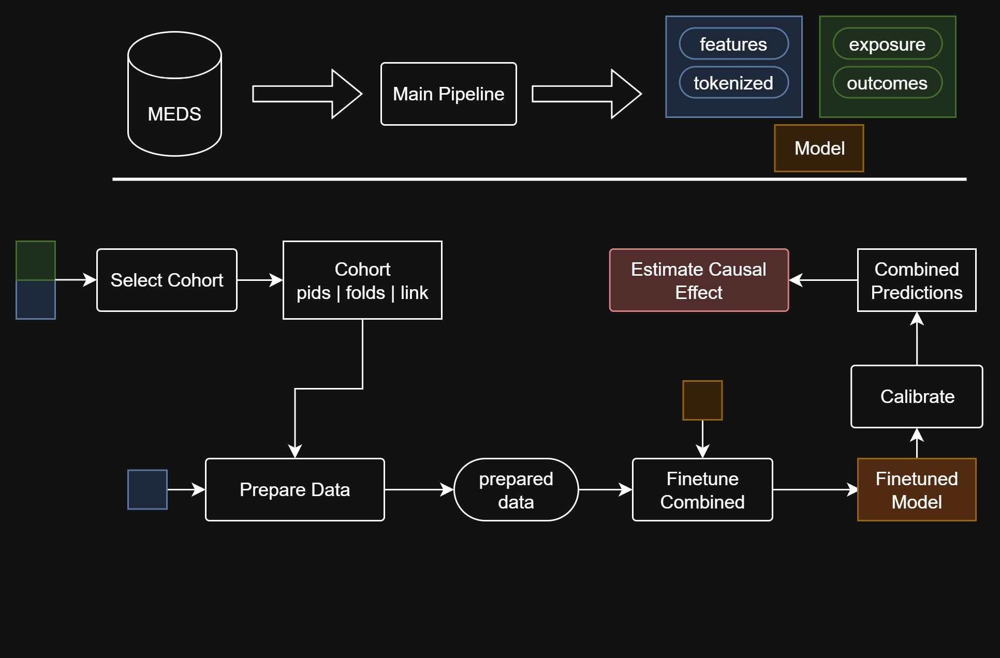

<p align="center"></p>

[](https://github.com/kirilklein/bonsai-causal/actions/workflows/pipeline.yml)
[](https://github.com/kirilklein/bonsai-causal/actions/workflows/causal_pipeline.yml)
[](https://github.com/kirilklein/bonsai-causal/actions/workflows/unittests.yml)
[](https://github.com/kirilklein/bonsai-causal/actions/workflows/format.yml)
[](https://github.com/kirilklein/bonsai-causal/actions/workflows/lint.yml)


> **Transformer-based EHR modeling (BONSAI) extended with a full causal-inference pipeline: cohort matching, joint exposure/outcome finetuning, calibration, and effect estimation (IPW, AIPW, TMLE) with bootstrap or analytic CIs, plus semi-synthetic validation.**

**BONSAI Causal** is the causal-inference extension of [BONSAI](https://github.com/FGA-DIKU/EHR), a ModernBERT pipeline for Electronic Health Records in [MEDS](https://github.com/Medical-Event-Data-Standard/meds) format. BONSAI answers *"will this patient have outcome Y?"*; this repo additionally answers *"what is the effect of exposure A on outcome Y?"* by using the transformer as a propensity and outcome model inside standard causal estimators. It powers the [semaglutide target trial emulation](https://github.com/kirilklein/semaglutide-tte).

---

## Table of Contents

- [Key Features](#key-features)
- [Directory Overview](#directory-overview)
- [Getting Started](#getting-started)
  - [Virtual Environment Setup](#virtual-environment-setup)
- [Pipeline](#pipeline)
  - [Converting to MEDS](#converting-to-meds)
  - [1. Create Data](#1-create-data)
  - [2. Pretrain](#2-pretrain)
  - [3. Create Outcomes](#3-create-outcomes)
  - [3.1 Create Cohort](#31-create-cohort)
  - [4. Finetune](#4-finetune)
- [Causal Inference Pipeline](#causal-inference-pipeline)
- [Azure Integration](#azure-integration)
- [Contributing](#contributing)
- [License](#license)
- [Citation](#citation)

---

## Key Features

- **End-to-end EHR Pipeline**: Tools for data ingestion, cleaning, and feature extraction.
- **BERT-based Modeling**: Pretraining on massive EHR corpora followed by task-specific finetuning.
- **Cohort Management**: Flexible inclusion/exclusion logic, temporal alignment, outcome definition.
- **Causal Inference**: Exposure/control cohort selection with index-date matching, joint exposure–outcome finetuning, probability calibration, and effect estimation via [CausalEstimate](https://github.com/kirilklein/CausalEstimate): IPW, AIPW and TMLE with bootstrap CIs, or `TMLE_TH` for a single-shot TMLE with analytic (influence-curve) CIs; chosen per run via `methods` in the estimate config.
- **Validation**: Cross-validation and out-of-time evaluation; semi-synthetic and fully simulated outcomes with known effects to check the estimators end to end.
- **Scalable**: Runs locally on the bundled synthetic data or on Azure ML for full-scale data.

---

## Directory Overview

Below is a high-level overview of the most important directories:

- **main**: Primary pipeline scripts (create_data, pretrain, finetune, etc.)
- **main_causal**: Causal pipeline scripts (select_cohort_full, finetune_exp_y, calibrate, estimate, simulate) ([detailed overview](corebehrt/main_causal/README.md))
- **modules**: Core implementation of model architecture and data processing ([detailed overview](corebehrt/modules/overview.md))
- **configs**: YAML configuration files for each pipeline stage ([causal configs guide](corebehrt/configs/causal/README.md))
- **functional**: Pure utility functions supporting module operations ([detailed overview](corebehrt/functional/overview.md))
- **azure**: Cloud deployment and execution utilities ([azure instructions](corebehrt/azure/README.md))
- **experiments**: Azure configs for the studies run with this repo (semaglutide, TRACE)

## Getting Started

### Virtual Environment Setup

For running tests and pipelines, create and activate a virtual environment, then install the required dependencies:

```bash
python -m venv .venv
source .venv/bin/activate
(.venv) pip install -r requirements.txt
```

## Pipeline



Below is a high-level description of the steps in the BONSAI pipeline. For detailed configuration options, see the [main README](corebehrt/main/README.md).
The pipeline can be run from the root directory by executing the following commands:

```bash
(.venv) python -m corebehrt.main.create_data
(.venv) python -m corebehrt.main.prepare_training_data --config_path corebehrt/configs/prepare_pretrain.yaml
(.venv) python -m corebehrt.main.pretrain
(.venv) python -m corebehrt.main.create_outcomes
(.venv) python -m corebehrt.main.select_cohort
(.venv) python -m corebehrt.main.prepare_training_data --config_path corebehrt/configs/prepare_finetune.yaml
(.venv) python -m corebehrt.main.finetune_cv
(.venv) python -m corebehrt.main.select_cohort --config_path corebehrt/configs/select_cohort_held_out.yaml
(.venv) python -m corebehrt.main.prepare_training_data --config_path corebehrt/configs/prepare_held_out.yaml
(.venv) python -m corebehrt.main.evaluate_finetune --config_path corebehrt/configs/evaluate_finetune.yaml
```

### Converting to MEDS

Before using BONSAI, you need to convert your raw healthcare data into the [MEDS (Medical-Event-Data-Standard) format](https://github.com/Medical-Event-Data-Standard/meds) format. We provide a companion tool [ehr2meds](https://github.com/FGA-DIKU/ehr2meds) to help with this conversion:

- Converts source data (e.g., hospital EHR dumps, registry data) into MEDS
- Performs code normalization and standardization
- Provides configuration options for handling different data sources
- Includes validation to ensure data quality

### 1. Create Data

- **Goal**: Convert **MEDS** into **tokenized features** suitable for model training.
- **Key Tasks**:
  - **Vocabulary Mapping**: Translates raw medical concepts (e.g., diagnoses, procedures) into numerical tokens.
  - **Temporal Alignment**: Converts timestamps into relative positions (e.g., hours or days from an index date).
  - **Incorporate Background Variables**: Incorporates static features such as age, gender, or other demographics.
- **Efficient Output**: Produces a structured parquet format that can be rapidly loaded in subsequent steps.

### 2. Pretrain

- **Goal**: Train a ModernBERT model via masked language modeling.
- **Key Tasks**:
  - Large scale self-supervised training on EHR sequences
  - Embedding temporal relationships between medical events
  - Saves checkpoints for downstream finetuning

### 3. Create Outcomes

- **Goal**: Generate outcomes from the formatted data for supervised learning.
- **Key Tasks**:
  - Search for specific concepts (medications, diagnoses, procedures) in the data
  - Optionally create exposure definitions for more complex study designs

### 3.1 Create Cohort

- **Goal**: Define the study population
- **Key Tasks**:

  - Apply inclusion/exclusion criteria (e.g. age, prior outcomes)
  - Generate index dates for each patient
  - Produce folds and test set for cross-validation

### 4. Finetune

- **Goal**: Adapt the pretrained model for specific binary outcomes
- **Key Tasks**:
  - K-fold cross-validation
  - Includes early stopping and evaluation on test set

For a detailed overview of the pipeline, see the [main README](corebehrt/main/README.md).

## Causal Inference Pipeline



The full chain runs end to end on the bundled synthetic MEDS data (`example_data/synthea_meds_causal`) in a few minutes on CPU; this is exactly what CI runs:

```bash
C=corebehrt/configs/causal
(.venv) python -m corebehrt.main.create_data                --config_path $C/prepare_and_pretrain/create_data.yaml
(.venv) python -m corebehrt.main.prepare_training_data      --config_path $C/prepare_and_pretrain/prepare_pretrain.yaml
(.venv) python -m corebehrt.main.pretrain                   --config_path $C/prepare_and_pretrain/pretrain.yaml
(.venv) python -m corebehrt.main.create_outcomes            --config_path $C/outcomes.yaml
(.venv) python -m corebehrt.main_causal.select_cohort_full  --config_path $C/select_cohort_full/extract.yaml   # exposed/control cohort, index-date matching
(.venv) python -m corebehrt.main_causal.prepare_ft_exp_y    --config_path $C/finetune/prepare/simple.yaml     # sequences with exposure + outcome targets
(.venv) python -m corebehrt.main_causal.finetune_exp_y      --config_path $C/finetune/simple.yaml             # joint propensity + outcome model
(.venv) python -m corebehrt.main_causal.calibrate_exp_y     --config_path $C/finetune/calibrate.yaml          # calibrate predicted probabilities
(.venv) python -m corebehrt.main_causal.estimate            --config_path $C/estimate.yaml                    # IPW + TMLE (bootstrap CIs) and TMLE_TH (analytic CI)
```

Effect estimates land in `outputs/causal/estimate/simple/` as a CSV with one row per method and outcome.

- **Cohort selection**: inclusion/exclusion criteria as logical expressions over codes, ages and lab values; control index dates drawn from the exposed distribution with optional age matching.
- **Joint finetuning**: one transformer predicts exposure propensity and (counterfactual) outcome probabilities from the same representation.
- **Estimation**: predicted propensities and outcomes are passed to [CausalEstimate](https://github.com/kirilklein/CausalEstimate). The default `estimate.yaml` runs `IPW`, `TMLE` (bootstrap CIs) and `TMLE_TH` (analytic CI); `AIPW` is available by adding it to `methods` (see `estimate_generated_data.yaml`).
- **Validation with known effects**: `simulate_semisynthetic` / `simulate_from_sequence` generate outcomes with a specified true effect on real patient histories, so the whole chain can be checked for bias before use on real outcomes.

See the [causal pipeline README](corebehrt/main_causal/README.md) and the [config guide](corebehrt/configs/causal/README.md) for details.

## Azure Integration

For running BONSAI on Azure cloud infrastructure using SDK v2, refer to the [Azure guide](corebehrt/azure/README.md). This includes:

- Configuration setup for Azure
- Data store management
- Job execution in the cloud
- Environment preparation

## Contributing

We welcome contributions! Please see our [Contributing Guidelines](CONTRIBUTING.md) for details on:

- Code style and formatting
- Testing requirements
- Pull request process
- Issue reporting

## License

This project is licensed under the MIT License - see the [LICENSE](LICENSE) file for details.

## Citation

If you use BONSAI Causal in your research, please cite this repository:

```bibtex
@software{klein2026bonsaicausal,
  author = {Klein, Kiril Vadimovic},
  title  = {BONSAI Causal: transformer-based causal inference on electronic health records},
  year   = {2026},
  url    = {https://github.com/kirilklein/bonsai-causal}
}
```

The underlying sequence model builds on [BONSAI](https://github.com/FGA-DIKU/EHR) and the [CORE-BEHRT](https://arxiv.org/abs/2404.15201) paper (Odgaard, Klein et al., 2024); please cite those as well when using the modeling pipeline.
