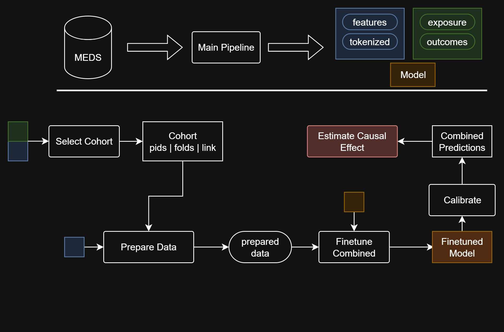
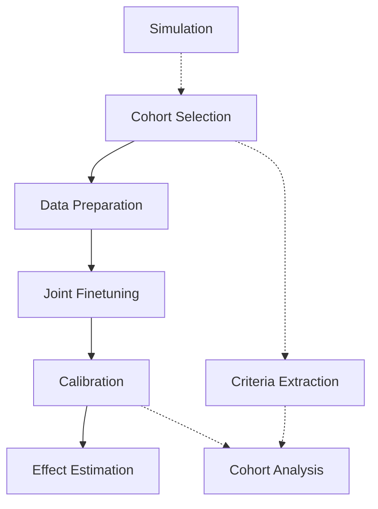

# Causal Analysis Pipeline for Transformer-based EHR Models

This pipeline enables rigorous causal inference analysis for patient outcomes by combining transformer-based representation learning with established causal inference methodologies. It provides a complete workflow from cohort selection through effect estimation with ground truth validation capabilities.

## Prerequisites: Main Pipeline Steps

Before proceeding with the causal analysis, run the relevant parts of the main pipeline (see [main README](../main/README.md)):

1. **`create_data`** - Convert MEDS data to features and tokenize
2. **`prepare_training_data`** (pretrain) - Prepare data for pretraining  
3. **`pretrain`** - Train base transformer model on medical sequences
4. **`create_outcomes`** - Define and extract outcome events

Once these steps are complete, proceed with the causal-specific pipeline below.

## Causal Analysis Workflow

The causal pipeline consists of five main steps, with optional components for validation and analysis:

### Core Pipeline

## Step 1: Cohort Selection

**Script:** [`select_cohort_full.py`](select_cohort_full.py)

Identifies exposed and control patients, applies inclusion/exclusion criteria, and performs index date matching to create balanced cohorts for causal analysis.

**Key Features:**

- **Exposure-based matching**: Draws index dates for controls from exposed patients
- **Inclusion/exclusion criteria**: Flexible medical code and age-based filtering
- **Age-adjusted sampling**: Optional age matching between groups
- **Death date validation**: Ensures control index dates don't exceed death dates

**Outputs:**

- Selected patient cohort with index dates
- Cross-validation fold assignments
- Cohort statistics and balance diagnostics

## Step 2: Data Preparation

**Script:** [`prepare_ft_exp_y.py`](prepare_ft_exp_y.py)

Prepares datasets for joint exposure and outcome modeling by creating training sequences with both exposure and outcome targets.

**Key Features:**

- **Dual target creation**: Both exposure propensity and outcome prediction
- **Temporal windowing**: Configurable exposure and outcome observation periods
- **Sequence truncation**: Manages computational complexity while preserving information
- **Group-wise follow-up**: Different observation windows by treatment group

**Outputs:**

- Tokenized sequences with dual labels
- Cross-validation splits ready for training

## Step 3: Joint Exposure-Outcome Finetuning

**Script:** [`finetune_exp_y.py`](finetune_exp_y.py)

Trains a transformer model to jointly predict both exposure propensity and outcome probabilities, enabling counterfactual reasoning through shared representations.

**Key Features:**

- **Multi-task learning**: Simultaneous exposure and outcome prediction
- **Shared representations**: Optional shared encoder for confounding focus
- **Progressive freezing**: Adaptive layer freezing based on validation performance
- **PCGrad optimization**: Gradient-based multi-task conflict resolution

**Outputs:**

- Cross-validation models for each fold
- Prediction performance metrics
- Training curves and diagnostics

## Step 4: Probability Calibration

**Script:** [`calibrate_exp_y.py`](calibrate_exp_y.py)

Adjusts predicted probabilities to ensure they are well-calibrated, which is crucial for reliable causal inference.

**Key Features:**

- **Multiple calibration methods**: Platt scaling, isotonic regression
- **Cross-fold consistency**: Ensures calibration across CV folds
- **Reliability diagnostics**: Calibration plots and error metrics
- **Probability adjustment**: Transforms raw outputs to calibrated estimates

**Outputs:**

- Calibrated probability estimates
- Calibration diagnostic plots
- Reliability and sharpness metrics

## Step 5: Causal Effect Estimation

**Script:** [`estimate.py`](estimate.py)

Implements various causal inference methods to estimate treatment effects using calibrated predictions, with comprehensive uncertainty quantification.

**Key Features:**

- **Multiple estimators**: IPW, TMLE, AIPW with bootstrap confidence intervals
- **Common support analysis**: Overlap assessment and extreme weight handling
- **Effect types**: ATE, ATT, ATC estimation
- **Bias sensitivity**: Optional systematic robustness analysis

**Outputs:**

- Treatment effect estimates with confidence intervals
- Covariate balance analysis
- Effect visualization and diagnostics

## Optional Components

### Realistic Outcome Simulation

**Script:** [`simulate_from_sequence.py`](simulate_from_sequence.py)

Generates synthetic outcomes with known causal effects while preserving real patient data complexity, enabling method validation against ground truth.

**Purpose:**

- **Method validation**: Compare estimates against known true effects
- **Robustness testing**: Evaluate performance under different scenarios
- **Power analysis**: Determine sample size requirements

**Key Features:**

- **Latent confounding structure**: Hidden factors affecting treatment and outcomes
- **Realistic complexity**: Uses actual patient sequences as foundation
- **Flexible effect sizes**: Multiple outcomes with varying causal effects
- **Temporal preservation**: Maintains timing and sequencing of medical events

### Cohort Characterization

**Scripts:** [`extract_criteria.py`](helper_scripts/extract_criteria.py) + [`get_stats.py`](helper_scripts/get_stats.py)

Two-step process for comprehensive cohort analysis and covariate balance assessment.

**Workflow:**

1. **Extract Criteria**: Generate patient-level covariates from medical data
2. **Analyze Statistics**: Compute descriptive statistics and balance metrics

**Applications:**

- **Baseline characterization**: Understand patient population and exposure patterns
- **Balance assessment**: Evaluate covariate balance before/after adjustment
- **Method validation**: Assess overlap, effective sample sizes, and adjustment quality

## Data Flow Overview
